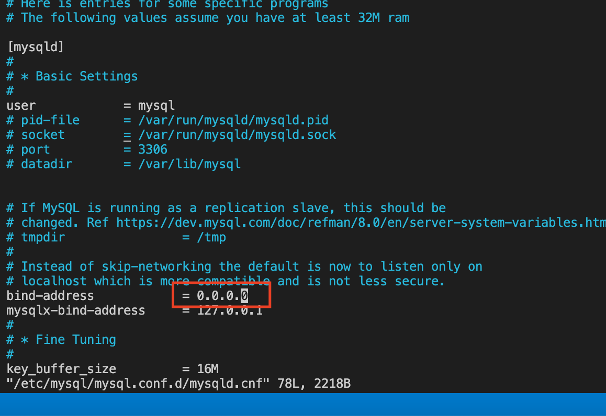

### CLIENT-SERVER ARCHITECTURE WITH MYSQL
 I will start this project off by creating two EC2 instances on AWS. One will be called mysql-client and the other will be called mysql-server. The objective of this exercise is to create a test_db database on the client and then remotely accessing this databse from the client without using the ssh comment. 

#### SERVER Instance

Start off by connecting to the mysql-server instance and updating the server's package index:

`sudo apt update -y`

Then install mysql on the server with the code:

`sudo apt install mysql-server -y`

Run the following:

`sudo systemctl enable mysql`

#### CLIENT Instance

Now go to the mysql-client instance and start off by updating the client's package index:

`sudo apt update -y`

Then install mysql on the client with the code:

`sudo apt install mysql-client -y`

#### Open port 3306 for communication
Open up port 3306 on your EC2 instance on the inbound rules. This is because mysql server uses port 3306 by default. For added security, not all IP addresses will be allowed to communicate over this port, I will be limiting communication only to the IP address of my mysql client 

Use `ip addr show` in the client terminal to find the IP address. In this case, the address to use is `172.31.11.67/20` Note that the type is `mysql/aurora`. See snapshot below:

NOW GO BACK TO THE SERVER INSTANCE

Run the secure installation script on the server which houses the database

`sudo mysql_secure_installation` 

Now you can log into the database with `sudo mysql`

#### Create a new user 

within the mysql interface, I will create a user called `remote_user`, the password for this user is `password` and the `%` sign below indicates that the user can log into the server database from any IP address

`CREATE USER 'remote_user'@'%' IDENTIFIED WITH mysql_native_password BY 'password';`

#### Create the Database

Now you need to create the Database with the code below:

`CREATE DATABASE test_db;`

#### Grant all Privileges to the new user

We also need to grant this newly created `remote_user` with all privileges with the code below:

The generic code is shown below:

`mysql> GRANT ALL PRIVILEGES ON database_name.* TO 'username'@'localhost';`

But the below code is run for this project:

`GRANT ALL PRIVILEGES ON test_db.* TO 'remote_user'@'%';`

#### Update the Grant tables
This is done as we have just modified the grant tables by granting all privileges to remote_user. Run the code below:

`FLUSH PRIVILEGES;`

Now exit the mysql console with with the code `exit;`

#### Configure MYSQL server to allow connections from remote hosts

The bind-address configuration within MySQL tells MySQL on which networks it can listen for connections. We want to modify this on our server to any ip address

Do this by running the code below:

`sudo vi /etc/mysql/mysql.conf.d/mysqld.cnf`

Now replace the `bind-address` from `127.0.0.1` in the file to `0.0.0.0` (Tip for finding this quicker is to type `/bind-address` and this will take us to the location quicker)

Now save the file and exit

As you have modified the mysql configuration file, you have to restart the mysql service by running the code below:

`sudo systemctl restart mysql`

#### Connect remotely from `mysql client` linux server to `mysql server` without using SSH utility to perform this action

Now on CLIENT instance, type the following:

`sudo mysql -u remote_user -h [ip-address-of-server] -p `

you will be prompted to enter the password and then you will be connected to the mysql of the server

#### Check you have sucessfully connected to the remoted MYSQL on the server by performing SQL queries

Now run the following on the client instance:

`SHOW DATABASES;`

Below is a snapshot of the result from running above command:

In the above, you can see the test_db database which was created on the server. 

